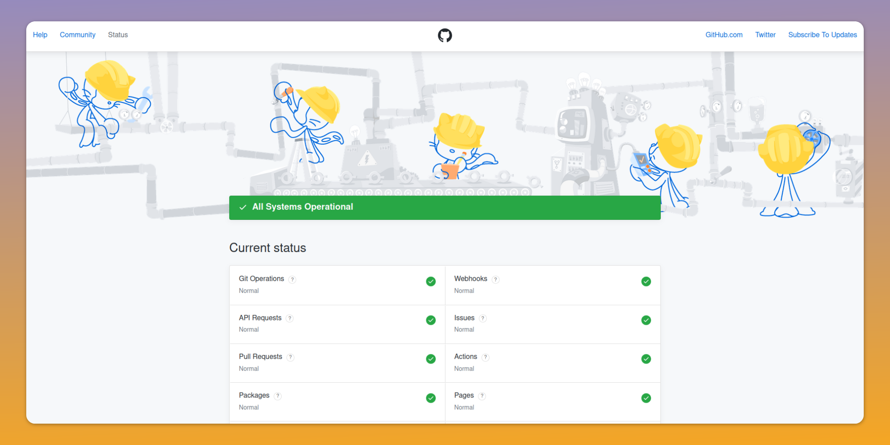

<head>
<meta property="og:image" data-rh="true" content="https://storage.googleapis.com/ihub-static-storage/blog/status-page.jpg" />
<meta name="twitter:image" data-rh="true" content="https://storage.googleapis.com/ihub-static-storage/blog/status-page.jpg" />
<meta name="author" content="Hrishikesh Barua"/>
</head>

## Introduction

Downtime is inevitable but what sets successful businesses apart is how they handle it. A key part of incident management is
incident communication with both internal and external stakeholders. A status page is a crucial tool for maintaining clear communication 
with users during outages or service interruptions. There are numerous status page providers available with different features. 
This article will guide you through best practices for selecting a provider that suits your needs.

## The Importance of a Status Page

An internal status page provider your colleagues and stakeholders in your organization to get a [snapshot of of the current status](https://incident.io/blog/internal-status-pages). It can help
reduce unnecessary back and forth between teams, and help people to prioritize their work better. It also creates internal transparency and trust between teams.

An external status page is crucial if you say you are committed to open communication with your end users or customers. Whether you are B2B or B2C, a public status page would
be the first thing people would check if they face issues. Being open about incidents and your efforts to mitigate them build user trust. They can also decrease support ticket volume
during incidents.

You can choose an [open source](/The-2024-Guide-to-Open-Source-Status-Page-Providers) status page provider, or one that is managed. This guide focuses on the factors to look at while evaluating managed providers.

## Key Factors to Consider When Choosing a Status Page Provider

### 1. Reliability

Your status page needs to be accessible especially when your main services are down. Your provider should be able to guarantee a reasonable amount of
- Uptime SLA
- Globally distributed infrastructure for high availabilty
- Redundant systems to ensure failover and availability
- Scalability to handle increased traffic during major incidents
<!-- truncate -->
### 2. Customization Options

Prioritize providers that offer customization options.

#### Functional customization
- Support for components - This is important if your product/platform has many services and is served from many independent locations. Each such service/location should be a component in the status page so that 
you can publish incident updates only against the affected components.
- Support for different types of events - At least maintenance events, informational events, and incidents should be supported.
- Localization options - If your have customers distributed across the globe, you would want to serve locale specific pages in different languages.
- Ability to update older entries - As new information flows in during an incident, you might want to update previously published information like the title or the affected components for completeness.

#### Branding
- Your status page should reflect your brand. Look for a provider that allows you to customize your status page with your brand's logo and color scheme.
- Custom domain support - Instead of serving the status page from the provider's domain you should be able to host it on your own domain - e.g. status.mydomain.com

### 3. Integration Capabilities

Efficient incident management requires easy tool integration. At the very least you should look for
- [API access](https://www.statuspal.io/blog/why-use-a-status-page-api-and-best-alternatives) for automating the incident management updates that you will publish
- Integration with your [monitoring and alerting](/The-Benefits-of-a-Single-Incident-Management-System) tools

At the consumer end, i.e. for people who will see your status page, it's good to have integration capabilities 
like webhooks, REST APIs, Slack, text, etc so that they can integrate with the systems they want.

### 4. Reporting and Analytics

Data-driven insights can help improve your incident response and post-mortem sessions. Choose a provider which offers:
- Detailed incident history with configurable retention. The entire history need not be displayed on the page, but it hould be available to your internal teams for analysis.
- Metrics and trends - Metrics can help you pinpoint services that need extra attention from your teams.
- Customizable reports for stakeholders. This is mostly useful for internal stakeholders in your organization.
- Page traffic - Some providers offer analytics to help you understand how often users check your status page and what they're viewing.

### 5. User Management and Permissions

For larger organizations, granular access control is important. Look for:
- Role-based access control (RBAC).
- Multi-user support.
- Audit logs for accountability.

### 6. Mobile Support

In our mobile-first world, ensure your provider offers:
- Responsive design for all devices.
- SMS and email notification options.

### 7. Customer Support

When issues arise with the status page, prompt support is essential. Choose providers that have:

- Clear SLA - Review the provider's SLA to ensure they meet your uptime and response time expectations.
- 24/7 customer support.
- Multiple support channels (chat, email, phone).
- Comprehensive documentation and notifications about updates to the status page format or APIs.

## Best Practices for Implementing Your Status Page

Once you've chosen a provider, follow these best practices:

1. Timely updates : Keep your status page updated with correct information. For internal status pages it should be the first reference point for other teams to know the status.
2. Be proactive: Communicate scheduled maintenance in advance and note down which systems would be affected.
3. Use plain language: Avoid technical jargon in your updates as much as possible.
4. Provide context: Explain the impact of incidents on the end user experience. Users are interested in how an incident affects them or their work before anything else.
5. Offer workarounds if available.
6. Learn: Use incident data to enhance your systems and processes by feeding incident metrics and trends back into your post-mortems. This can help in building a culture of continuous improvement.

## A Note About Internal vs External Status Pages
Internal status pages are available for viewing only by your organization's members. External status pages are available for viewing by everybody, including your customers, users, and the general public.

If it's an internal status page, the kind of updates you publish would be different from that of an external status page. Your internal stakeholders are part of the same organization, so you can 
publish more internal, technical details. Although it's important to include specific technical details in the post mortem report for public pages also,
 you have to be careful not to publish internal system details which might compromise security. Also note that publishing expected times of 
 resolution [can backfire](https://firehydrant.com/blog/hot-take-dont-provide-incident-resolution-estimates/).

## Conclusion

Choosing the right status page provider is a key decision that will affect your communication strategy during critical moments. Select a provider that not only meets your current needs but can also grow with your business. A 
status page reflects your commitment to transparency, so make sure you invest time in choosing the provider that is right for you.

[Here is a list](https://github.com/ivbeg/awesome-status-pages) of status page related software and services.