<head>
<meta property="og:image" data-rh="true" content="https://storage.googleapis.com/ihub-static-storage/blog/open-source-status-page-providers.jpg" />
<meta name="twitter:image" data-rh="true" content="https://storage.googleapis.com/ihub-static-storage/blog/open-source-status-page-providers.jpg" />
</head>

## Introduction

Maintaining transparent communication about service availability is crucial for businesses of all sizes. Status pages are an important part of your communication 
strategy during times of outages and maintenance events. 

You can [choose](/Best-Practices-Choosing-Status-Page-Provider) to go with a fully managed status page provider, or host an open-source one yourself.

Open source status page providers offer a cost-effective and customizable solution. However, then can come with their own drawbacks.
This guide explores open source status page providers in 2024 to help you choose the right tool for your needs.

- [Introduction](#introduction)
- [List of Open Source Status Page Providers](#list-of-open-source-status-page-providers)
  - [1. Cachet](#1-cachet)
  - [2. Statping-ng](#2-statping-ng)
  - [3. Cstate](#3-cstate)
  - [4. Upptime](#4-upptime)
  - [5. Staytus](#5-staytus)
  - [6. Vigil](#6-vigil)
  - [7. Gatus](#7-gatus)
  - [8. Statuspal](#8-statuspal)
  - [9. Uptime Kuma](#9-uptime-kuma)
  - [10. OneUptime](#10-oneuptime)
  - [11. Kener](#11-kener)
  - [12. OpenStatus](#12-openstatus)
- [Choosing the Right Open Source Status Page Provider](#choosing-the-right-open-source-status-page-provider)
- [Conclusion](#conclusion)

## List of Open Source Status Page Providers

### 1. Cachet

Cachet is a popular open source status page system built with PHP and Laravel. It offers a clean, minimalist design and a robust feature set.
<!-- truncate -->
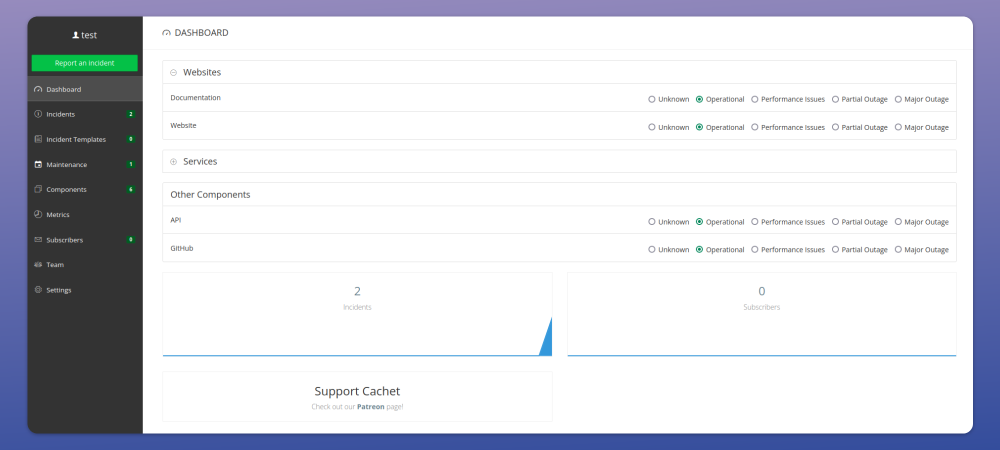

**Key Features:**
- Easy installation and setup
- Metric graphs for visualizing performance
- Maintenance scheduling
- Multilingual support
- Metrics
- Service components
- Two-factor authentication
- RESTful API for integrations
- Subscriber notifications via email

**Source Code**: https://github.com/cachethq/cachet

**Live page examples**:
- https://status.gnome.org/
- https://status.eea.europa.eu/

### 2. Statping-ng

Statping-ng is a Go-based status page that emphasizes simplicity and ease of use. It supports both SQLite and MySQL databases. 
Statping-ng is an updated replacement of statping after development stopped on the original fork.

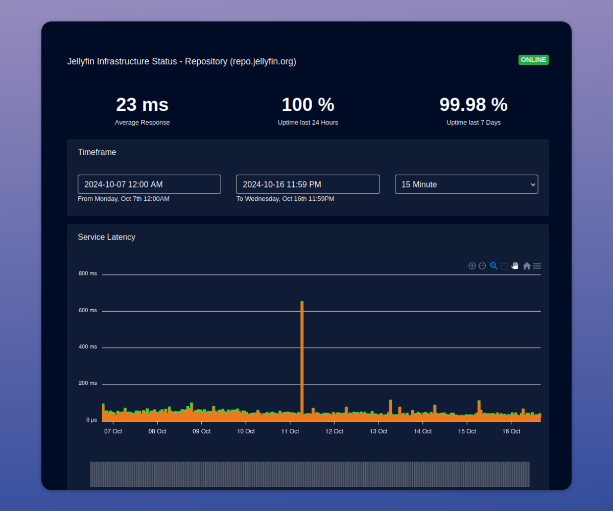

**Key Features:**
- Lightweight and fast
- Built-in monitoring capabilities
- Mobile-friendly design
- Native mobile apps for Android and iOS
- Customizable themes
- Prometheus exporter for advanced monitoring
- Notifications on Slack, Email, and Twilio.
- Plugin framework

**Source Code**: https://github.com/statping-ng/statping-ng

**Live page examples**:
- https://status.jellyfin.org/service/repository 

### 3. Cstate

Cstate is a Hugo-based static status page generator that emphasizes simplicity and performance.

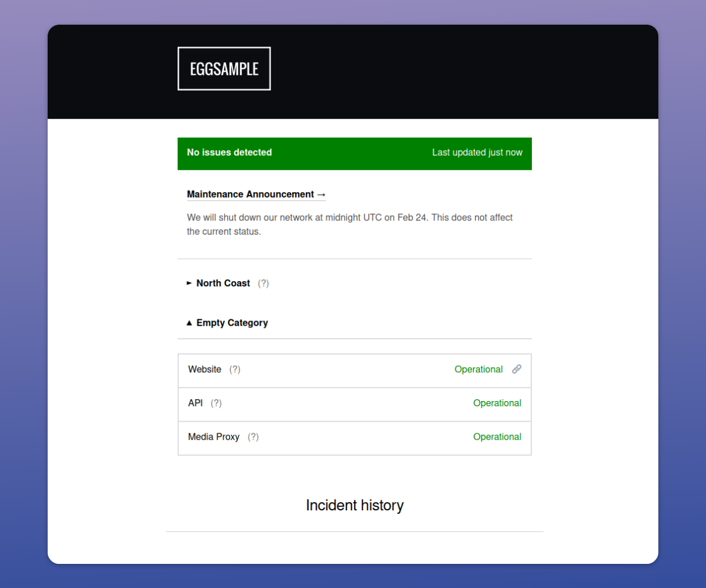

**Key Features:**
- Fast page load times
- Fully customizable through Hugo templates
- Supports multiple content formats (YAML, JSON, TOML)
- Automatic light/dark mode
- Easy deployment to Netlify or GitHub Pages

**Source Code**: https://github.com/cstate/cstate 

**Live page examples**: 
- https://cstate.mnts.lt/ 
- https://status.chocolatey.org/
- https://status.sr.ht/
- https://status.contentignite.com/
- https://status.fsci.in/
- https://status.testing-farm.io/

### 4. Upptime

Upptime is a GitHub-powered open source uptime monitor and status page generator.

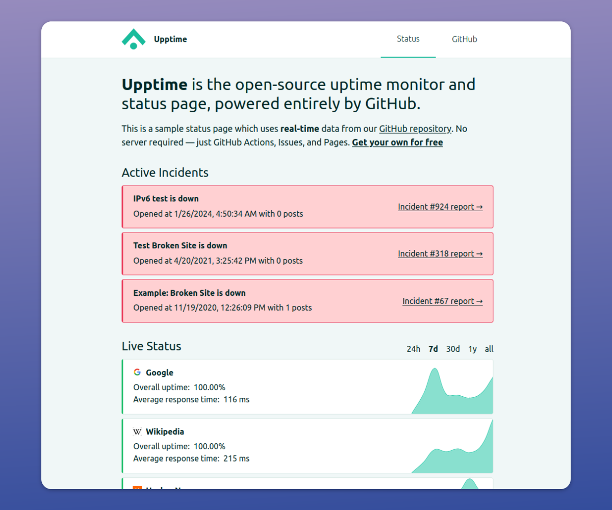

**Key Features:**
- No server required - runs entirely on GitHub Actions
- Real-time notifications via GitHub Issues
- Custom domain and SSL support through GitHub Pages
- Graphs and badges for displaying uptime
- Integrates with various monitoring services

**Source Code**: https://github.com/upptime/upptime

**Live page examples**:
- https://up.researchequals.com/
- https://status.opensourcepos.org/
- https://grinnode-live.github.io/upptime/
- https://upptime.chenshaowen.com/

### 5. Staytus
Staytus is another Ruby-based status page system that focuses on simplicity and ease of use. It has not been updated in a while, but the developer notes in the project's README that 

_"I'm hoping to do a bit more work on Staytus soon. One of the main things I want to achieve will be to provide Staytus as a container rather than requiring people to install it manually on servers which seems to
 be cause of a number of issues."_

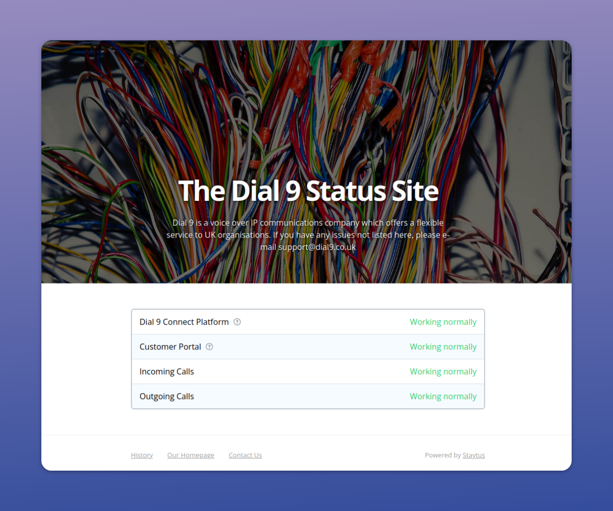

**Key Features:**
- Clean, responsive design
- Email and SMS notifications
- Easy-to-use admin interface
- Support for multiple services and locations
- Maintenance scheduling
- JSON API to update status

**Source Code**: https://github.com/adamcooke/staytus 

**Live page examples**:
- https://status.dial9.co.uk/ 
- https://krystalstatus.uk/ 

### 6. Vigil
Vigil is a lightweight status page written in Rust, designed for high performance and low resource usage.

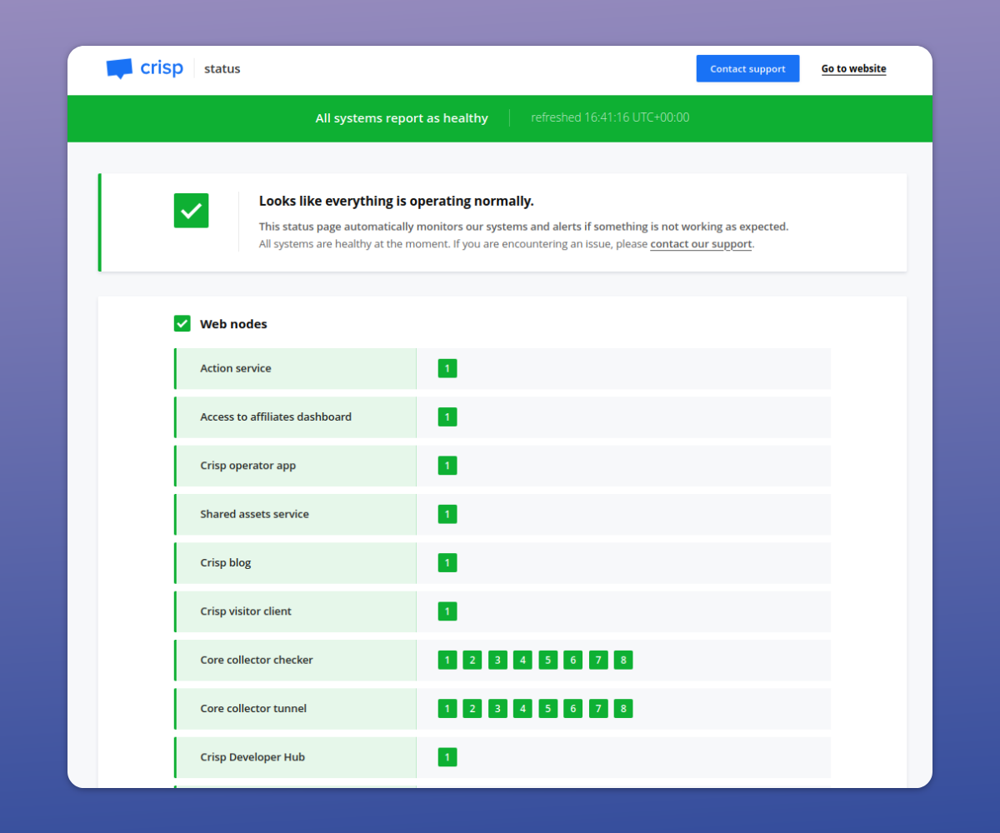

**Key Features:**
- Simple configuration using TOML files
- Built-in monitoring capabilities for HTTP/TCP/ICMP, application services, and local services (e.g. on a different network away from the main server)
- Support for push notifications
- Planned maintenance notices
- Integrates with Slack, Email, Twilio SMS, XMPP, Telegram, webhooks

**Source Code**: https://github.com/valeriansaliou/vigil 

**Live page examples:**
- https://status.crisp.chat/ 
- https://status.autosign.io/
- https://status.autoinspector.ai

### 7. Gatus
Gatus is a health dashboard and status page that monitors services and endpoints using HTTP, TCP, and other network protocols.

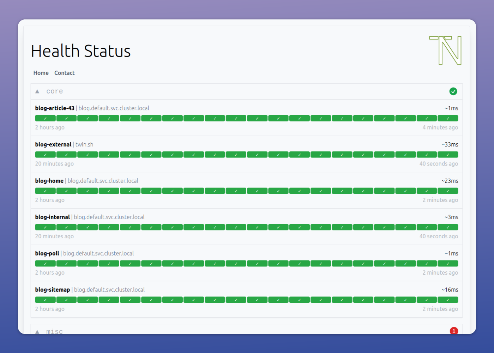

**Key Features:**
- Inbuilt health checks - HTTP, ICMP, TCP, DNS
- Condition-based rule evaluation of health query results
- Customizable alerting - supports various providers like Slack, PagerDuty, Twilio, Discord, MS Teams
- Metrics visualization
- Easy to configure using YAML
- Badges
- Docker support for easy deployment

**Source Code**: https://github.com/TwiN/gatus

**Live page examples:**
- https://status.twin.sh/ 

### 8. Statuspal
Statuspal is an Elixir-based status page system. The repository has not been updated in a while as of this writing but they also offer a managed version.

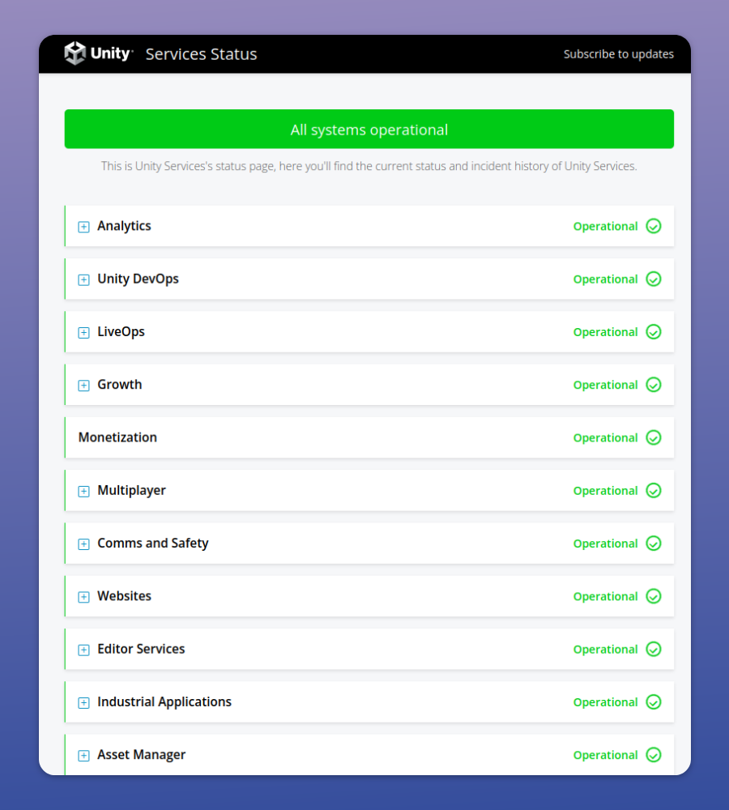

**Key Features:**
- Email and Tweet notifications
- Component support
- API for integration with monitoring tools
- Multi-language support
- Scheduled maintenance announcements

**Source Code**: https://github.com/statuspal/statuspal 

**Live page examples:**
- https://status.unity.com/

### 9. Uptime Kuma
Uptime Kuma is a monitoring tool with a built-in status page feature.

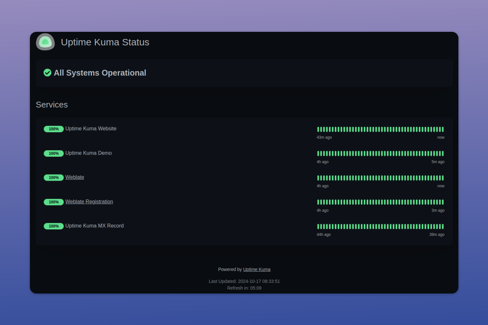

**Key Features:**
- Uptime monitoring for HTTP/TCP/DNS etc
- Multi-language support
- Various notification options (Telegram, Discord, SMS, Email, etc.)
- 2-factor authentication
- Docker support

**Source Code**: https://github.com/louislam/uptime-kuma

**Live page examples:**
- https://status.legioneetruria.com/status/core 
- https://status.kuma.pet/ 

### 10. OneUptime
An observability platform that also has status pages.

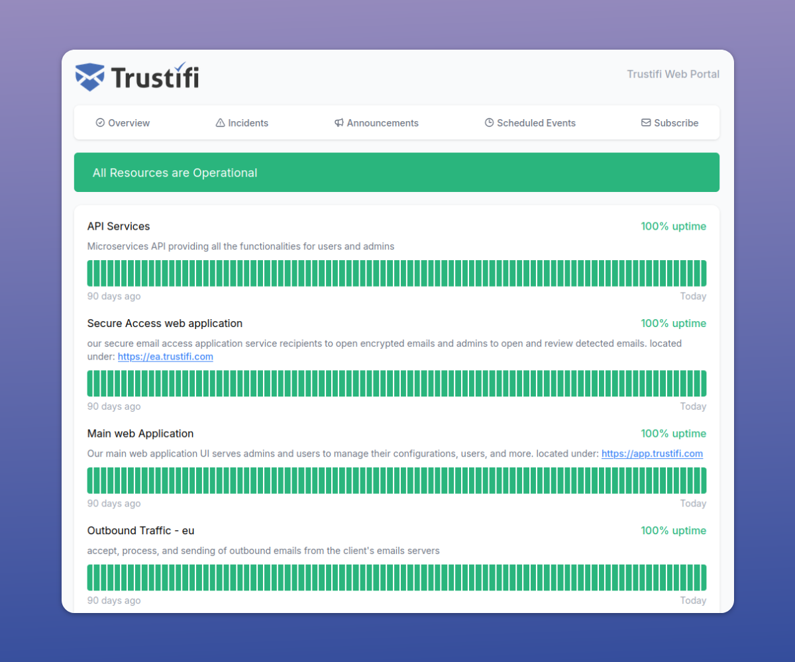

**Key Features:**
- Uptime monitoring
- Notifications via Email, SMS, Slack etc
- Custom branding on your status page
- Incident Management workflow
- On-call policies, schedules and alerts
- Log management
- Workflow support
- Application Performance Monitoring

**Source Code**: https://github.com/OneUptime/oneuptime 

**Live page examples**:
- https://status.bowiestate.edu/
- https://status.trustifi.com/ 
- https://status.talkwalker.com/ 

### 11. Kener
Monitoring and status page tool written in Node.js.

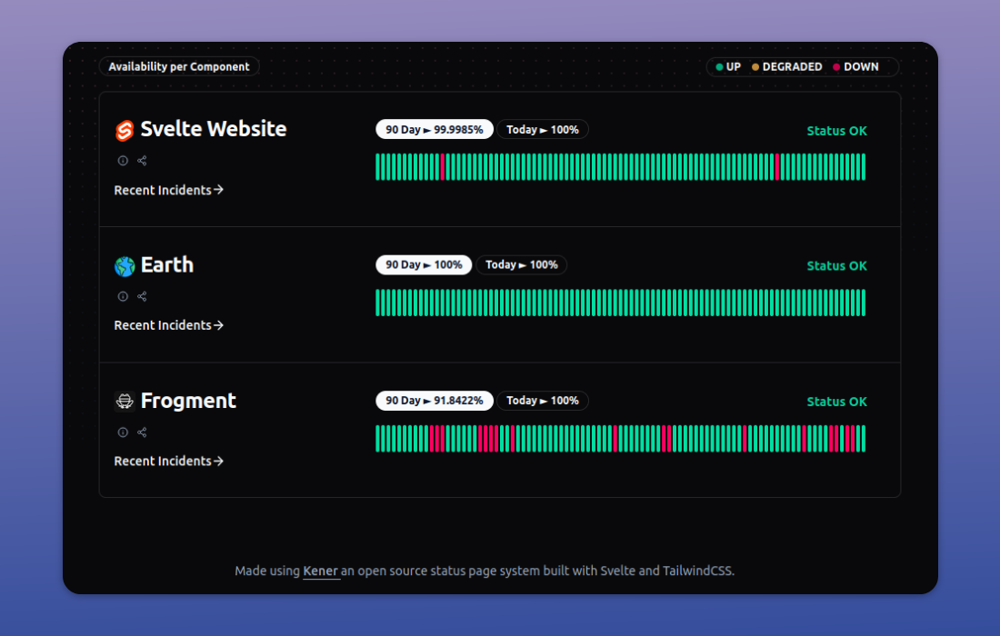

**Key Features**
- Real-time monitoring with support for HTTP endpoints
- Timezone support
- Cron-based scheduling
- YAML based configuration
- Docker support
- Customizable branding
- i18n support
- Incident creation in GitHub issues

**Source Code**: https://github.com/rajnandan1/kener

**Live page examples:**
- https://api.status.cobb.app/incident/portal-api
- https://status.gosu.bar/incident/backstage-server

### 12. OpenStatus
A performance monitoring platform written in Typescript and Go.

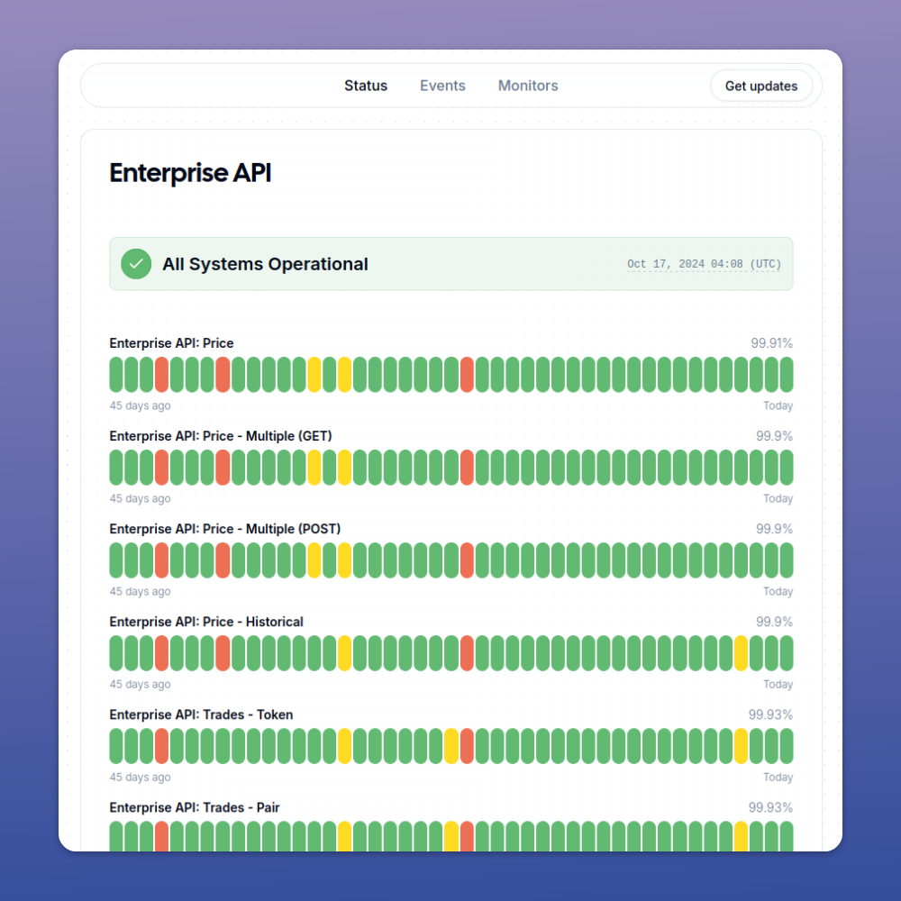

**Key Features**
- Password protection
- Scheduled maintenance support
- User notification support via email

**Source Code:**
https://github.com/openstatusHQ/openstatus

**Live page examples:**
- https://aiproductshot.openstatus.dev/
- https://astro.openstat.us/
- https://bds-status.birdeye.so/

## Choosing the Right Open Source Status Page Provider

When selecting an open source status page provider, consider the following factors:

1. Ease of installation and maintenance
2. Compatibility with your existing tech stack
3. Customization options and flexibility
4. Community activity and long-term support
5. Integration capabilities with your monitoring tools
6. Performance and scalability
7. Notification and alerting options
8. Historical data retention and display
9. User management and access control

To elaborate on #5 - some of these status pages are part of a bigger monitoring toolkit where the status data 
is drawn from the same toolkit's monitors. If the status page does not support data from other sources you might not be able to use only the status page feature in such tools.
Others are standalone status pages - where you can push incident events from anywhere you want. This is an important factor to keep in mind.

## Conclusion

Open source status page providers offer a cost-effective way to keep your users informed about your service's health and performance. By choosing the right tool from this guide, you can enhance transparency, build trust with your users, and streamline your incident communication process.

Social share photo by <a href="https://unsplash.com/@markusspiske?utm_content=creditCopyText&utm_medium=referral&utm_source=unsplash">Markus Spiske</a> on <a href="https://unsplash.com/photos/black-and-gray-laptop-computer-turned-on-FXFz-sW0uwo?utm_content=creditCopyText&utm_medium=referral&utm_source=unsplash">Unsplash</a>
  