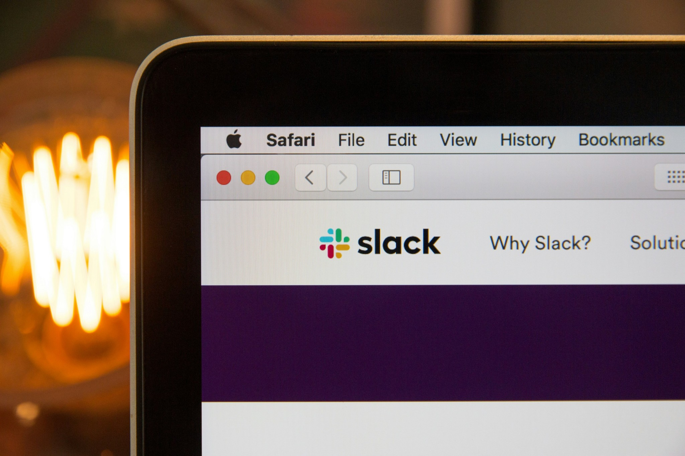

<head>
<meta property="og:image" data-rh="true" content="https://storage.googleapis.com/ihub-static-storage/blog/slack-incident-management.jpg" />
<meta name="twitter:image" data-rh="true" content="https://storage.googleapis.com/ihub-static-storage/blog/slack-incident-management.jpg" />
<meta name="author" content="Hrishikesh Barua"/>
</head>

## Introduction

Why is Slack becoming so popular in incident management?

Slack is one of the most popular communication tools used in companies. If you're part of a remote team, 
your team is probably on Slack or something similar like MS Teams. Although IM tools lack the communication nuances
that are taken for granted in face to face interactions, they provide many other advantages:
- Access to historical data
- Asynchronous communication
- The ability to share links and documents easily
- Adding anybody in the organization to a conversation

### Slack in Incident Management
One of the trends I've noticed in incident management is the growing rise of Slack in incident response and management tools. I think this is tied to the increase in remote work after COVID-19. 

COVID-19 saw a tremendous increase in the usage of [Zoom](https://www.theverge.com/2020/4/23/21232401/zoom-300-million-users-growth-coronavirus-pandemic-security-privacy-concerns-response), 
[Slack](https://x.com/stewart/status/1243000509666955264), [Google Meet](https://www.infoq.com/news/2020/08/google-meet-scaling/) and similar tools. Remote work increased post COVID-19, and the tools
evolved to support this. A natural consequence of a bigger remote workforce was more workflows moving to remote communication tools. The tools themselves evolved as platforms and there were other tools
built on top of them. Incident Management is one such workflow that has benefited.

### Benefits of Using Slack in Incident Management
- Incident lifecycle events are easier to share and analyze on such a platform. Sharing a dashboard URL, PagerDuty event link, Git commit link, link to a log file 
from your observability stack - these are all easy to paste in your collaboration tool.
- Communication is more streamlined. You can create dedicated incident channels and use threads to organize discussions.
- Integration with incident management tools - Slack has an extensive ecosystem of popular incident management platforms that integrate with it. These also include ticketing systems like Zendesk.
- Improved visibility - It's easier to post status updates, share the results of Root Cause Analyses (RCA), share debug logs and screenshots - because everyone in your org is on Slack (or whichever tool it is). Anyone can check progress without having to be rebriefed.
- Faster response times from on-call folks.

This explains why so many incident response and management tools are either being built using Slack as a foundation, or have tight integration with Slack.

### Tools That Use Slack for Incident Management
A non-exhaustive list of such tools and their features:
- [Pagerly](https://Pagerly.io) - Manage on-call, ticket creation, incident lifecycle all within Slack
- [Incident](https://Incident.io) - Lets you setup a dedicated channel per incident using a single command and manage it from there
- [FireHydrant](https://FireHydrant.com) - Integrates with Slack and lets you manage incidents from there
- [OpsLane](https://OpsLane.com) - Operates directly in Slack channels, provides additional info and debugging resources
- [PagerDuty](https://PagerDuty.com) - You can trigger/ack/resolve incidents directly in Slack and create on-demand Slack channels for incidents
- [OpsGenie](https://www.atlassian.com/software/opsgenie) - Bidirectional integration allowing you to manage incidents
- [BetterStack](https://betterstack.com) - The entire incident lifecycle management in a dedicated Slack channel
- [Rootly](https://rootly.com) - Create dedicated Slack channels, manage incident lifecycle events and on-call schedules
- [Zenduty](https://zenduty.com) - Fetch alerts, create and assign incidents based on on-call schedules

#### Features of Such Tooling
These tools are not limited to lifecycle management. They also add context to the incident:
- Links to runbooks
- Pulling in data from your infra and service catalogs
- Relevant log entries from your observability systems
- Key metrics that might be related to the incident
- On-call information including schedules and escalation policies
- Related incidents in other services
- Related incidents in [third-party services](/Monitoring-Third-Party-Vendors-As-An-Ops-Engineer-SRE)

This is an evolution of the [ChatOps](https://www.infoq.com/news/2016/03/operable-cog-chatops-platform/) model which created chat tooling used for devops collaboration and automation tasks.

The next level of incident management is AI-driven incident response agents, where the AI agent takes the first shot at figuring out the root cause of the incident, and proposes mitigation steps. There are already a few of those - but it will be a while before they are mature enough.

## Conclusion
Slack and other IM-based communication tools are playing an increasingly important role in the incident management process. Popular incident management platforms have tightly integrated with Slack, and some of them
are built entirely using Slack as a base. The future will likely see the maturing of AI-powered incident response tools.

Photo credits: <a href="https://unsplash.com/@hostreviews?utm_content=creditCopyText&utm_medium=referral&utm_source=unsplash">Stephen Phillips - Hostreviews.co.uk</a> on <a href="https://unsplash.com/photos/slack-logo-aE0iX-bLCJc?utm_content=creditCopyText&utm_medium=referral&utm_source=unsplash">Unsplash</a>
